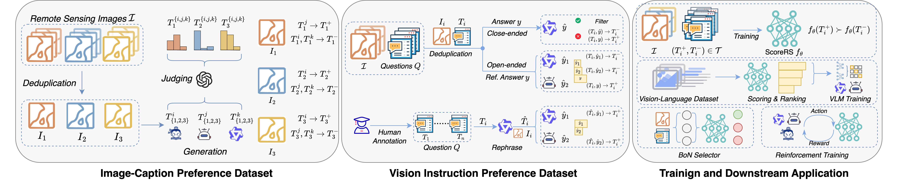

<h1 align="center"> Quality-Driven Curation of Remote Sensing Vision-Language Data via Learned Scoring Models </h1> 

    
    
    
    

  

We introduce ScoreRS, a quality assessment model trained on carefully curated large-scale remote sensing vision-language preference data. ScoreRS effectively scores and filters vision-language datasets, improving model performance by selecting high-quality data for training.

## News
+ 🎉🎉🎉 Our work has been accepted for NeurIPS 2025, and we have released our training and evaluation code. Please stay tuned for the new version of our paper, with tons of exciting new results!
+ Please checkout the [blogpost](https://thinkable-technician-883.notion.site/ScoreRS-Quality-Driven-Curation-of-Remote-Sensing-Vision-Language-Data-via-Learned-Scoring-Models-1aed4688ded08153a298da10d690c30e) for the chain-of-thought behind this project :).
+ Our report is available at [arXiv](https://arxiv.org/abs/2503.00743) now!
+ 🎉🎉🎉 We release our report [here](./assets/ScoreRS.pdf). Our [data](https://huggingface.co/datasets/LHRS/RSRM) and [model](https://huggingface.co/collections/PumpkinCat/scorers-67beba8b1f20eec61f2d0c12) are also released!
+ We release our ScoreRS model, finetuned CLIP, Qwen2VL, and our basic codebase!

## Table of Contents
- [News](#news)
- [Environment Setup](#environment-setup)
  - [Basic Environment](#basic-environment)
  - [VLLM Environment](#vllm-environment)
  - [RL Environment](#rl-environment)
- [Get Started](#get-started)
  - [ScoreRS](#scorers)
  - [CLIP](#clip)
  - [Qwen2VL-RS Series](#qwen2vl-rs-series)
  - [Lmdeploy Example](#lmdeploy-example-usage-of-qwen2vl-rs-series)
  - [VLLM Example](#vllm-example-usage-of-qwen2vl-rs-series)
  - [Gradio Example](#gradio-example-usage-of-qwen2vl-rs-series)
- [Training](#training)
  - [Score Model Training](#score-model-training)
  - [CLIP Training](#clip-training)
  - [Large VLMs Training](#large-vlm-training)
  - [RL Training](#rl-training)
- [Evaluation](#evaluation)
  - [CLIP Evaluation](#clip-evaluation)
  - [LVLM Evaluation](#lvlm-evaluation)
  - [BoN](#bon-evaluation)
- [Data](#data)
- [Possible Error and Fix](#possible-error-and-fix)
- [Acknowledgement](#acknowledgement)
- [Statement](#statement)

## Environment Setup

### Basic Environment

This environment used for score model training, inference, demonstrations, fine-tuning CLIP and Qwen2VL, without other specifics; you should use this environment.

~~~shell
conda create -n scorers python==3.12 -y
conda activate scorers

cd scorers  # important!!!!!!! Make sure you are under the projcet directory for the following command.
bash basic_env_setup.sh
~~~

### VLLM Environment
Use this environment for BoN prediction.
~~~shell
conda create -n scorers_vllm python==3.12 -y
conda activate scorers_vllm

cd scorers  # important!!!!!!! Make sure you are under the projcet directory for the following command.
bash vllm_env_setup.sh
~~~

### RL Environment
Use this for RL training.
~~~shell
conda create -n verl python==3.12 -y
conda activate verl

cd scorers/customVeRL
pip install torch
pip install -e .
pip install pandas fastparquet
~~~

## Get Started

### ScoreRS

~~~python
import sys
sys.path.append("path_to_ScoreRS_code_root")  # make sure to replace this line with your path to ScoreRS folder
import torch
from src.model.qwen_reward import Qwen2Reward
from transformer import AutoProcessor
from qwen_vl_utils import process_vision_info
from transformers.models.qwen2_vl.configuration_qwen2_vl import Qwen2VLConfig

image_path = "./dummy_folder/your_image.png"
device = "cuda"

processor = AutoProcessor.from_pretrained("PumpkinCat/ScoreRS")
processor.tokenizer.padding_side = "right"

model_config = Qwen2VLConfig.from_pretrained("PumpkinCat/ScoreRS")
model_config.pad_token_id = processor.tokenizer.pad_token_id
model_config.ranked_candidate_num = 1
model = Qwen2Reward.from_pretrained(
    "PumpkinCat/ScoreRS",
    config=model_config,
    torch_dtype=torch.float16,
    attn_implementation="flash_attention_2",
    device_map=device
)
 
messages = [
    {
        "role": "user",
        "content": [
            {
                "type": "image",
                "image": image_path,
            },
            {"type": "text", "text": "A satellite image airport"},
        ],
    }
]

text = processor.apply_chat_template(
    messages, tokenize=False, add_generation_prompt=True
)
image_inputs, video_inputs = process_vision_info(messages)
inputs = processor(
    text=[text],
    images=image_inputs,
    videos=video_inputs,
    padding=True,
    return_tensors="pt",
)
inputs = inputs.to(model.device)

with torch.no_grad() and torch.autocast("cuda", dtype=torch.float16):
  outputs = model(**inputs, return_dict=True, return_loss=False)
 
scores = outputs.value
print(scores)  # score
~~~

### CLIP

~~~python
from PIL import Image
import torch
from transformers import CLIPProcessor, CLIPModel

device = "cuda"
torch_dtype = torch.float16

model = CLIPModel.from_pretrained("PumpkinCat/CLIP-ViT-L14-ScoreRS30", device_map=device, torch_dtype=torch_dtype)
processor = CLIPProcessor.from_pretrained("PumpkinCat/CLIP-ViT-L14-ScoreRS30")

image_path = "./dummy_folder/your_image.png"
image = Image.open(image_path)

inputs = processor(text=["a satellite image of airport", "a staellite image of sea"], images=image, return_tensors="pt", padding=True)

outputs = model(**inputs)
logits_per_image = outputs.logits_per_image # this is the image-text similarity score
probs = logits_per_image.softmax(dim=1) # we can take the softmax to get the label probabilities
~~~

### Qwen2VL-RS Series

~~~python
from transformers import AutoProcessor
from transformers.models.qwen2_vl.modeling_qwen2_vl import (
    Qwen2VLForConditionalGeneration,
)
from qwen_vl_utils import process_vision_info

R1_SYSTEM_PROMPT = "A conversation between User and Assistant. The user asks a question, and the Assistant solves it. The assistant first thinks about the reasoning process in the mind and then provides the user with the answer. The reasoning process and answer are enclosed within <think> </think> and <answer> </answer> tags, respectively, i.e., <think> reasoning process here </think><answer> answer here </answer>"

use_thinking = True  # whether you want to use Qwen2VL-RS-R1 or Qwen2VL-RS
model_path = (
    "PumpkinCat/Qwen2VL-7B-RS-R1" if use_thinking else "PumpkinCat/Qwen2VL-7B-RS"
)
model = Qwen2VLForConditionalGeneration.from_pretrained(
    model_path, torch_dtype="auto", device_map="auto"
)
processor = AutoProcessor.from_pretrained(model_path)

image_path = "./dummy_folder/your_image.png"

messages = []

if use_thinking:
    messages.append(
        {"role": "system", "content": [{"type": "text", "text": R1_SYSTEM_PROMPT}]}
    )

messages.append(
    {
        "role": "user",
        "content": [
            {
                "type": "image",
                "image": image_path,
            },
            {"type": "text", "text": "Describe this image."},
        ],
    }
)

# Preparation for inference
text = processor.apply_chat_template(
    messages, tokenize=False, add_generation_prompt=True
)
image_inputs, video_inputs = process_vision_info(messages)
inputs = processor(
    text=[text],
    images=image_inputs,
    videos=video_inputs,
    padding=True,
    return_tensors="pt",
)
inputs = inputs.to(model.device)

# Inference: Generation of the output
generated_ids = model.generate(**inputs, max_new_tokens=256)
generated_ids_trimmed = [
    out_ids[len(in_ids) :] for in_ids, out_ids in zip(inputs.input_ids, generated_ids)
]
output_text = processor.batch_decode(
    generated_ids_trimmed, skip_special_tokens=True, clean_up_tokenization_spaces=False
)
print(output_text)
~~~

### Lmdeploy Example Usage of Qwen2VL-RS Series

~~~python
from lmdeploy import (
    GenerationConfig,
    TurbomindEngineConfig,
    pipeline,
    ChatTemplateConfig,
)
from lmdeploy.vl import load_image

use_thinking = True  # whether you want to use Qwen2VL-RS-R1 or Qwen2VL-RS
model_path = (
    "PumpkinCat/Qwen2VL-7B-RS-R1" if use_thinking else "PumpkinCat/Qwen2VL-7B-RS"
)

if use_thinking:
  reasoning_config = "./config/qwen2_thinking_template.json"
else:
  reasoning_config = None

model = pipeline(
            model_path,
            backend_config=TurbomindEngineConfig(session_len=8192),
            chat_template_config=(
                ChatTemplateConfig.from_json(reasoning_config)
                if reasoning_config
                else None
            ),
        )

generation_config = GenerationConfig(
            max_new_tokens=256,
            temperature=0.01,
            top_p=0.9,
            do_sample=True,
        )

image_path = "./dummy_folder/your_image.png"
image = load_image(image_path)
response = model(('describe this image', image))
print(response)
~~~

### VLLM Example Usage of Qwen2VL-RS Series

‼️ Make sure your environment satisfy the [VLLM Environment](#vllm-environment).

~~~python
from vllm import SamplingParams
from vllm import LLM
from transformer import AutoProcessor

# Qwen2-VL
def run_qwen2_vl(question: str, processor: AutoProcessor):
    placeholder = "<|image_pad|>"

    prompt = (
        "<|im_start|>system\nYou are a helpful assistant.<|im_end|>\n"
        f"<|im_start|>user\n<|vision_start|>{placeholder}<|vision_end|>"
        f"{question}<|im_end|>\n"
        "<|im_start|>assistant\n"
    )
    stop_token_ids = None
    return prompt, stop_token_ids

# Qwen2-VL-R1
def run_qwen2_vl_r1(question: str, processor: AutoProcessor):
    SYSTEM_PROMPT = (
        "A conversation between User and Assistant. The user asks a question, and the Assistant solves it. The assistant "
        "first thinks about the reasoning process in the mind and then provides the user with the answer. The reasoning "
        "process and answer are enclosed within <think> </think> and <answer> </answer> tags, respectively, i.e., "
        "<think> reasoning process here </think><answer> answer here </answer>"
    )

    placeholder = "<|image_pad|>"

    prompt = (
        f"<|im_start|>system\n{SYSTEM_PROMPT}<|im_end|>\n"
        f"<|im_start|>user\n<|vision_start|>{placeholder}<|vision_end|>"
        f"{question}<|im_end|>\n"
        "<|im_start|>assistant\n"
    )
    stop_token_ids = None
    return prompt, stop_token_ids
  
device = "cuda"
use_thinking = True  # whether you want to use Qwen2VL-RS-R1 or Qwen2VL-RS
model_path = (
    "PumpkinCat/Qwen2VL-7B-RS-R1" if use_thinking else "PumpkinCat/Qwen2VL-7B-RS"
)

llm = LLM(
    model=model_path,
    mm_processor_kwargs={
        "min_pixels": 28 * 28,
        "max_pixels": 1280 * 28 * 28,
    },
    disable_mm_preprocessor_cache=False,
    dtype="float16",
    device=device,
    gpu_memory_utilization=0.6,
)
processor = AutoProcessor.from_pretrained(model_path, trust_remote_code=True)

sampling_param = SamplingParams(
            temperature=0.01,
            top_p=0.9,
            max_tokens=16384,
        )

run_func = run_qwen2_vl_r1 if use_thinking else run_qwen2_vl
image_path = "./dummy_folder/your_image.png"
prompt = "describe the image."
questions, stop_token_ids = run_func(prompt, processor)
sampling_param.stop_token_ids = stop_token_ids
inputs = [
    {
        "prompt": questions,
        "multi_modal_data": {"image": image_path},
    }
]
outputs = llm.generate(inputs, sampling_params=sampling_param)
print(outputs)
~~~

### Gradio Example Usage of Qwen2VL-RS Series

+ Qwen2VL-RS

~~~shell
python ./python_script/web_demo.py -c PumpkinCat/Qwen2VL-7B-RS --flash-attn2
~~~

+ Qwen2VL-RS-R1

~~~shell
python ./python_script/web_demo.py -c PumpkinCat/Qwen2VL-7B-RS-R1 --flash-attn2 --reasoning
~~~

## Training

### Score Model Training

+ Please follow the instructions following these shell scripts ([Stage1](./script/train_reward_first_stage.sh), [Stage2](./script/train_reward_second_stage.sh), [Stage3](./script/train_reward_third_stage.sh)) for the first, second, and third stage training.

### CLIP Training

+ Please follow the [shell script](./script/train_clip_remoteclip.sh)

### Large VLM Training

+ Please follow the two shell script for fine-tuning large VLMs: [pretrain](./script/train_pretrain.sh), [sft](./script/train_sft.sh)

### RL Training

+ First, launch the score model server:

    ~~~shell
    cd customVeRL/exampels/reward_function
    
    uvicorn reward_server:app --host 0.0.0.0 --port 8000
    ~~~

+ Then, follow the instructions of this shell script: [RL Training](./customVeRL/examples/train_grpo.sh)

## Evaluation

### CLIP Evaluation

+ Classification:

    Please refer to [this file](./python_script/evaluation/clip_classification.py) for evluation CLIP on classification tasks.

+ Retrieval

    Please refer to [this file](./python_script/evaluation/eval_retrieval.py) for evluation CLIP on retrieval tasks.

### LVLM Evaluation

+ First download and unzip our published Eval dataset after the anonymous time.

+ For Evaluation Our Qwen2VL-RS Series (Shell Script)

    + Qwen2VL-RS

        ~~~shell
        SCRIPT_PATH=./python_script/evaluation/rs_evaluation.py
        DATA_ROOT="Your path to unzip folder"
        OUTPUT_DIR="Your path to eval log file"
        model_type=lmdeploy
        MODEL_PATH= # path to Qwen2VL-RS
        
        CUDA_VISIBLE_DEVICES=0 accelerate launch --num_processes 1 --mixed_precision bf16 $SCRIPT_PATH \
            --data_root $DATA_ROOT \
            --output_dir $OUTPUT_DIR \
            --model_type $model_type \
            --model_path $MODEL_PATH \
            --force_inference true \
            --task all
        ~~~

    + Qwen2VL-RS-R1

        ~~~shell
        ...  # same as above
        MODEL_PATH= # path to Qwen2VL-RS-R1
        REASONING_CONFIG=./python_script/evaluation/qwen2_thinking_template.json
        
        CUDA_VISIBLE_DEVICES=0 accelerate launch --num_processes 1 --mixed_precision bf16 $SCRIPT_PATH \
            --data_root $DATA_ROOT \
            --output_dir $OUTPUT_DIR \
            --model_type $model_type \
            --model_path $MODEL_PATH \
            --force_inference true \
            --task all \
            --reasoning_config $REASONING_CONFIG
        ~~~

+ Qwen2-VL, LLaVA-1.6, and InternVL-2.5

    ~~~shell
    ...  # same as eval on Qwen2VL-RS
    model_type=lmpdeloy
    MODEL_PATH=Qwen/Qwen2-VL-7B-Instruct  # liuhaotian/llava-v1.6-vicuna-7b or OpenGVLab/InternVL2_5-8B
    ... # same as eval on Qwen2VL-RS
    ~~~

+ GeoChat, VHM, and SkysenseGPT

    ~~~shell
    ...  # same as eval on Qwen2VL-RS
    model_type=geochat  # vhm or skysensegpt
    MODEL_PATH=MBZUAI/geochat-7B  # FitzPC/vhm_7B or ll-13/SkySenseGPT-7B-CLIP-ViT
    ... # same as eval on Qwen2VL-RS
    ~~~

+ LHRS-Bot-Nova

    + First, download the  converted Huggingface-style checkpoint from [here](https://huggingface.co/LHRS/LHRS-Bot-Nova/tree/main/Stage3_HF)

        ~~~shell
        ...  # same as eval on Qwen2VL-RS
        model_type=lhrs
        MODEL_PATH="your_path_to FINAL.pt"  # important!!! must be point to FINAL.pt file and make sure the TextLoRA is under the same folder with the FINAL.pt
        ... # same as eval on Qwen2VL-RS
        ~~~

### BoN Evaluation

+ Make sure your are under the vllm environment settings.
    + For BoN evaluation on LHRS-Bench, please refer to [this file](./python_script/evaluation/lhrs_bench_bon.py).
    + For BoN evaluation on VG-DIOR, please refer to [this file](./python_script/evaluation/vg_bon.py).

## Data
+ Our preference data can be found at [Hugging Face](https://huggingface.co/datasets/LHRS/RSRM/tree/main).

## Possible Error and Fix
+ If you encounter an error related to "flash_attn" when using "Llama", please install "flash_attn" using the following command (from [here](https://github.com/oobabooga/text-generation-webui/issues/4357#issuecomment-2319573100)):

  `pip install https://github.com/Dao-AILab/flash-attention/releases/download/v2.5.8/flash_attn-2.5.8+cu122torch2.3cxx11abiFALSE-cp310-cp310-linux_x86_64.whl`

## Acknowledgement

+ We gratitude to the following repositories for their wonderful works:
    + [VHM](https://github.com/opendatalab/VHM)
    + [QwenVL](https://github.com/QwenLM/Qwen2.5-VL)
+ We are grateful to the wonderful works that provided the foundation for our project: [LHRS-Bot](https://github.com/NJU-LHRS/LHRS-Bot), [GeoChat](https://github.com/mbzuai-oryx/GeoChat), and [SkysenseGPT](https://github.com/Luo-Z13/SkySenseGPT).

## Statement

+ If you find our work is useful, please give us 🌟 in GitHub.
+ Licence: MIT